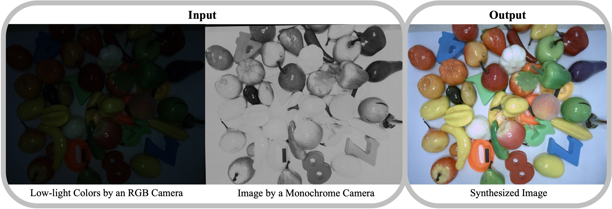
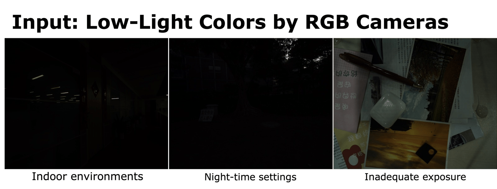

# LUCK: Lighting Up Colors in the Dark
In this repository we provide code of the paper:
> **LUCK: Lighting Up Colors in the Dark**

> Yaping Zhao, Edmund Y. Lam

<p align="center">

</p>

<p align="center">

</p>

## Requirments
This is the Pytorch implementation of our work. The next requirments and some other frequently-used Library will be needed.

1. Python >= 3.7
2. Pytorch >= 1.7.1
3. scikit-image 0.18.1
4. imageio 2.9.0
5. rawpy 0.17.0

You can simply run the following commands for pre-requisites:
```
conda env create -f environment.yml
conda activate h4m
```

## Dataset

We adopt the **MCR** 
[[Google Drive](https://drive.google.com/file/d/1_GWW1P1kjVBMFfN9AuaFq29w-kQ31ncd/view?usp=sharing),
[Baidu Netdisk](https://pan.baidu.com/s/1b3cmUenebeDT_8HdLGa9dQ) (Extraction code: 22cv)],
a dataset of colored raw and monochrome raw image pairs, captured with the same exposure setting. Each image has a resolution of 1280×1024.

The zip file contain 3 parts:
- Mono_Colored_RAW_Paired_DATASET
  - RGB_GT (498 images)
  - Mono_GT (498 images)
  - Color_RAW_Input (498 × 8 images)

Totally 498 different scenes, each scene has 1 corresponding RGB and Monochrome ground truth and 8 different exposure color Raw inputs.

(The 8 exposures Monochrome images are available at [Google Drive](https://drive.google.com/file/d/1mQml2a8U7HecRvCldxiwvjK4ZexUB7LU/view?usp=sharing), [Badui Netdisk](https://pan.baidu.com/s/1xvVKivKyjdgKomPI0F5pdQ) (Extraction code: 22cv) )

The file name contains the image information. Take the image name:"C00001_48mp_0x8_0x1fff.tif" as an example.

"C" means it is color raw image;

"00001" is the image number; 

"48mp" is the master clock frequency 48 MHz; 

"0x8" is the hex number of global gain; 

"0x1fff" indicate the shutter width of the camera which can calculate the exposure time. 

## Usage

The code is a bit messy right now, and I am tidying it up.
