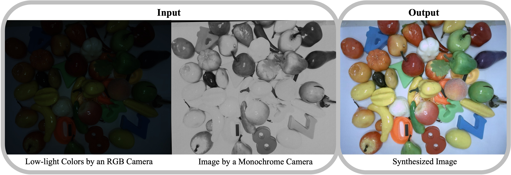
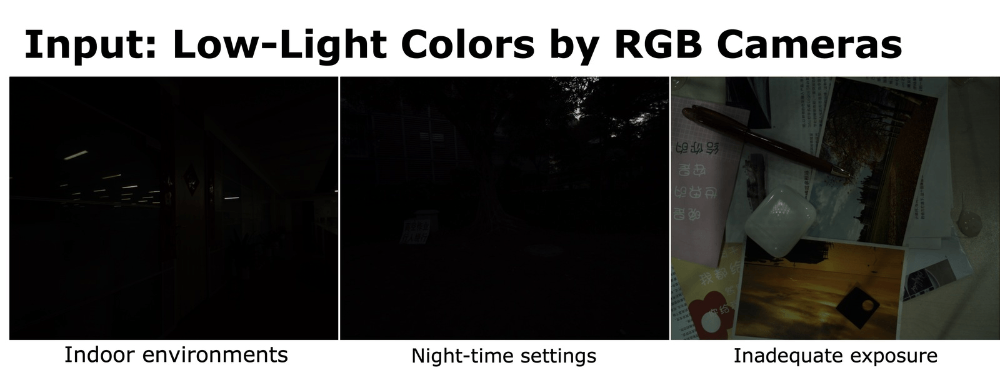

# LUCK: Lighting Up Colors in the Dark
In this repository we provide code of the paper:
> **LUCK: Lighting Up Colors in the Dark**

> Yaping Zhao, Edmund Y. Lam

<p align="center">

</p>

<p align="center">

</p>

## Requirments
This is the Pytorch implementation of our work. The next requirments and some other frequently-used Library will be needed.

1. Python >= 3.7
2. Pytorch >= 1.7.1
3. scikit-image 0.18.1
4. imageio 2.9.0
5. rawpy 0.17.0

You can simply run the following commands for pre-requisites:
```
conda env create -f environment.yml
conda activate h4m
```

## Dataset

We adopt the **MCR** 
[[Google Drive](https://drive.google.com/file/d/1_GWW1P1kjVBMFfN9AuaFq29w-kQ31ncd/view?usp=sharing),
[Baidu Netdisk](https://pan.baidu.com/s/1b3cmUenebeDT_8HdLGa9dQ) (Extraction code: 22cv)],
a dataset of colored raw and monochrome raw image pairs, captured with the same exposure setting. Each image has a resolution of 1280×1024.

The zip file contain 3 parts:
- Mono_Colored_RAW_Paired_DATASET
  - RGB_GT (498 images)
  - Mono_GT (498 images)
  - Color_RAW_Input (498 × 8 images)

Totally 498 different scenes, each scene has 1 corresponding RGB and Monochrome ground truth and 8 different exposure color Raw inputs.

(The 8 exposures Monochrome images are available at [Google Drive](https://drive.google.com/file/d/1mQml2a8U7HecRvCldxiwvjK4ZexUB7LU/view?usp=sharing), [Badui Netdisk](https://pan.baidu.com/s/1xvVKivKyjdgKomPI0F5pdQ) (Extraction code: 22cv) )

The file name contains the image information. Take the image name:"C00001_48mp_0x8_0x1fff.tif" as an example.

"C" means it is color raw image;

"00001" is the image number; 

"48mp" is the master clock frequency 48 MHz; 

"0x8" is the hex number of global gain; 

"0x1fff" indicate the shutter width of the camera which can calculate the exposure time. 

## Implementation

The 'random_path_list' contain the split train&test path lists in the dataset.

To reproduce the results in our paper, simply run the following script:

```bash
bash train_LUCK.sh
```
This will start training the network. Once the training converges, you will obtain results consistent with those reported in our paper.

Due to a file management oversight, we regret to inform you that the pre-trained model is no longer available.

However, we have preserved all training logs, and result files for full transparency. You can find them here:

---

## 📁 Results and Logs

We provide all training logs, evaluation metrics, and result snapshots as a substitute for the missing pre-trained model. These can be found in the shared archive:

👉 <a href="https://connecthkuhk-my.sharepoint.com/:f:/g/personal/zhaoyp_connect_hku_hk/EoBqkSpFa5xFlCK-3Z_ndhUBWVoREF91tHmH4UErEbidxA?e=bRvlOa" target="_blank"><strong>Download LUCK and Baseline Results</strong></a>

Contents of the archive:

- `LUCK_results.zip`:  
  Output results (e.g., predicted images or reconstructions) generated by our proposed **LUCK** method after training.

- `baseline_results.zip`:  
  Output results from the baseline method used for comparison in our experiments.

- `LUCK_metric_average.txt`:  
  Text summary of averaged performance metrics (e.g., PSNR, SSIM) for LUCK across the test set.

- `baseline_metric_average.txt`:  
  Corresponding performance summary for the baseline method.

- `LUCK_train_curve.csv`:  
  Training curve (e.g., loss, validation metrics per epoch) for LUCK in CSV format.

- `baseline_train_curve.csv`:  
  Training curve for the baseline method.

These files provide a transparent record of the training process and final results for reproducibility and benchmarking.

---

## 📌 Citation

Cite our paper if you find this project interesting!

```bibtex
@inproceedings{zhao2024luck,
  title={LUCK: Lighting Up Colors in the Dark},
  author={Zhao, Yaping and Lam, Edmund Y},
  booktitle={Optoelectronics Global Conference (OGC)},
  pages={51--55},
  year={2024},
  organization={IEEE}
}
```
This project is implemented based on [Abandoning the Bayer-Filter to See in the Dark](https://github.com/TCL-AILab/Abandon_Bayer-Filter_See_in_the_Dark).